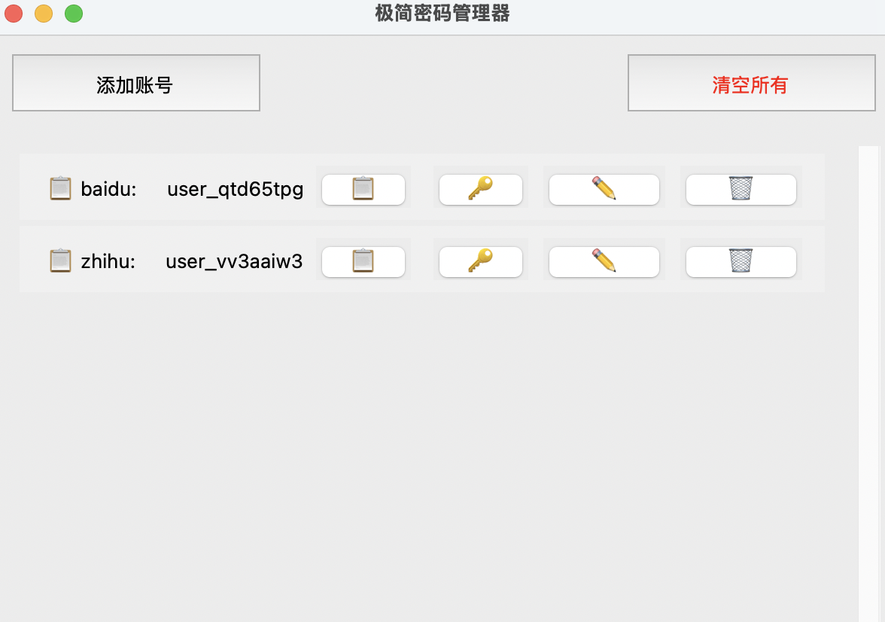

# 懒人密码管理器（一键版）

## 产品简介

这是一个为懒人打造的极致简化版密码管理器，专为非核心社交账户（如普通论坛、兴趣社区、小游戏账号等）设计。核心原则：零学习成本、一键操作、能少动手指就少动手指，所有数据明文存储在本地。

## 核心特性

### 🚀 懒人专属功能

1. **一键生成密码**
   - 默认配置：长度12字符、自动包含大小写字母+数字+符号
   - 操作：点击"添加账户"按钮 → 输入网站名称 → 选择是否随机生成用户名 → 系统自动生成密码并保存 → 密码自动复制到剪贴板
   - 懒人指数：⭐⭐⭐⭐⭐

2. **一键复制功能**
   - 复制用户名：点击账号旁的 📋 按钮
   - 复制密码：点击账号旁的 🔑 按钮
   - 操作：点一下就搞定，无需选择、无需右键
   - 懒人指数：⭐⭐⭐⭐⭐

3. **随机生成用户名**
   - 自动生成格式：`user_` + 8位随机字符（如 `user_ab12cd34`）
   - 操作：生成密码时选择"是"即可
   - 懒人指数：⭐⭐⭐⭐⭐

4. **多账号管理**
   - 每个网站可以添加多个账号
   - 无需担心网站名重复，系统自动处理
   - 懒人指数：⭐⭐⭐⭐

### 🎯 操作指南

| 功能 | 操作 | 效果 |
|------|------|------|
| 生成密码 | 点击"生成密码"按钮 | 自动生成并保存，密码复制到剪贴板 |
| 复制用户名 | 点击账号旁的 📋 | 用户名复制到剪贴板 |
| 复制密码 | 点击账号旁的 🔑 | 密码复制到剪贴板 |
| 修改密码 | 点击账号旁的 ✏️ | 可自动生成或手动输入新密码 |
| 删除账号 | 点击账号旁的 🗑️ | 一键删除账号 |
| 清空所有 | 点击"清空所有"按钮 | 一键清空所有账号 |

## 技术实现

- **平台**：Python + Tkinter GUI
- **数据存储**：本地JSON文件（accounts.json）
- **依赖**：pyperclip（用于剪贴板操作）

## 环境搭建

### 方法一：使用conda（可选）

1. **创建conda环境**
   ```bash
   conda create -n password_manager python=3.8 -y
   ```

2. **激活环境**
   ```bash
   conda activate password_manager
   ```

3. **安装依赖**
   ```bash
   pip install pyperclip
   ```

### 方法二：使用系统Python

1. **直接安装依赖**
   ```bash
   pip install pyperclip
   ```

## 使用方法

### 方法一：直接运行应用程序

1. **mac系统**
   - 双击 `dist/password_manager.app`

### 方法二：从源码运行

1. **启动应用**
   ```bash
   python password_manager.py
   ```

## 使用步骤

1. **首次使用**：启动后会显示说明使用方法和风险提示

2. **添加账号**：点击"添加账号"按钮，输入网站名称，选择是否随机生成用户名

3. **管理账号**：使用账号旁的操作按钮进行管理

## 风险提示

⚠️ **重要提示**：
- 本产品仅适用于非核心社交账号（如论坛、游戏、兴趣社区）
- 数据明文存储在本地，可能被他人通过文件管理器直接查看
- 绝不用于支付类账户！
- 使用本产品即表示您同意自行承担所有风险

## 适用场景

- 管理普通论坛账号
- 管理兴趣社区账号
- 管理小游戏账号
- 其他低风险的社交账号
- 任何不想动脑记密码的场景

## 懒人使用建议

1. **能随机生成就随机生成**：用户名和密码都让系统自动生成，省得自己想
2. **能复制就别手动输入**：点一下按钮就能复制，何苦自己敲键盘
3. **能一键操作就别多步**：所有功能都设计为最少点击次数

## 界面预览

### 主界面




## 总结

本密码管理器是懒人的福音，追求极致的便捷性和最少的操作步骤。无需学习、无需记忆、无需复杂操作，点几下鼠标就能搞定所有密码管理需求。适合管理低风险的普通账号，让你告别密码困扰，把精力放在更重要的事情上。

**懒人宣言**：能让电脑做的事，绝不自己动手！# LazyKey
